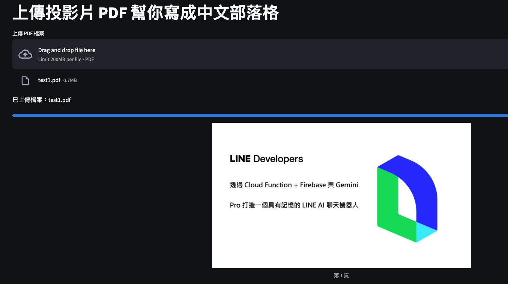
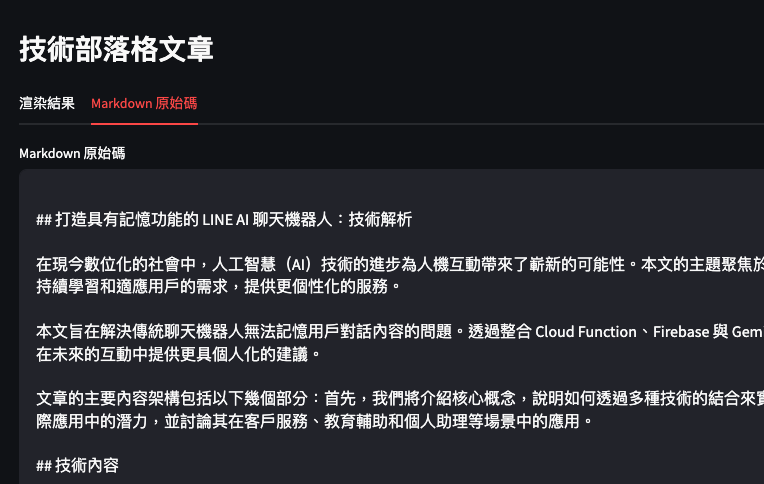

# PDF Slides to Blog Converter

這是一個基於 Streamlit 和 OpenAI 的應用程式，能夠自動將 PDF 格式的投影片轉換成結構化的技術部落格文章。

<table>
  <tr>
    <td><a href="img/pic1.png"></a></td>
    <td><a href="img/pic2.png"></a></td>
    <td><a href="img/pic3.png"></a></td>
  </tr>
</table>

## 功能特點

- 📝 自動分析 PDF 投影片內容
- 🖼 智慧識別投影片中的圖片和文字
- 📊 自動生成結構化的技術文章
- 🔍 針對每頁投影片進行深入分析
- 📄 生成包含前言和未來展望的完整文章
- 💾 支援 Markdown 格式輸出

## 系統需求

- Python 3.8 或更高版本
- OpenAI API 金鑰
- Poppler（用於 PDF 轉換）

## 安裝說明

1. Clone 專案：

```bash
git clone https://github.com/yourusername/pdf-slides-to-blog.git
cd pdf-slides-to-blog
```

2. 安裝 Dependency：

```bash
poetry install
```

3. 安裝系統 Dependency：（根據您的作業系統）：

Ubuntu/Debian：

```bash
sudo apt-get install poppler-utils
```

macOS：

```bash
brew install poppler
```

4. 設定環境變數：

```bash
export openai_api_key="your-api-key-here"
```

## 使用方法

1. 啟動應用程式：

```bash
streamlit run app.py
```

2. 在瀏覽器中開啟顯示的 URL（通常是 <http://localhost:8501）>

3. 上傳 PDF 投影片檔案

4. 等待處理完成，系統會自動生成：
   - 每頁投影片的詳細分析
   - 完整的技術部落格文章
   - Markdown 格式的文章原始碼

## 專案結構

```
pdf-slides-to-blog/
├── app.py              # 主程式
├── requirements.txt    # 依賴套件
├── README.md          # 說明文件
└── LICENSE            # MIT 授權
```

## 依賴套件

```text
streamlit==1.24.1
pdf2image==1.16.3
Pillow==9.5.0
pypdf==3.12.1
poppler-utils==0.1.0
langchain==0.1.0
langchain-core==0.1.10
langchain-community==0.0.13
langchain-openai==0.0.2
python-dotenv>=1.0.0
```

## 注意事項

1. 確保您有有效的 OpenAI API 金鑰
2. PDF 檔案必須是可讀取的格式
3. 處理時間可能因 PDF 大小和頁數而異
4. 建議使用虛擬環境來安裝套件

## 常見問題

**Q: 為什麼我的圖片無法正確顯示？**  
A: 確保您已經正確安裝了 Poppler 並且系統路徑設定正確。

**Q: 處理速度較慢怎麼辦？**  
A: 處理速度主要受限於 API 呼叫和 PDF 轉換，建議使用較小的 PDF 檔案進行測試。

**Q: 可以自訂輸出格式嗎？**  
A: 目前支援 Markdown 格式輸出，您可以修改程式碼中的提示詞來調整輸出格式。

## 貢獻指南

歡迎提交 Pull Requests 和 Issues！

## 授權

本專案採用 MIT 授權條款 - 詳見 [LICENSE](LICENSE) 檔案

```
MIT License

Copyright (c) 2024 Your Name

Permission is hereby granted, free of charge, to any person obtaining a copy
of this software and associated documentation files (the "Software"), to deal
in the Software without restriction, including without limitation the rights
to use, copy, modify, merge, publish, distribute, sublicense, and/or sell
copies of the Software, and to permit persons to whom the Software is
furnished to do so, subject to the following conditions:

The above copyright notice and this permission notice shall be included in all
copies or substantial portions of the Software.

THE SOFTWARE IS PROVIDED "AS IS", WITHOUT WARRANTY OF ANY KIND, EXPRESS OR
IMPLIED, INCLUDING BUT NOT LIMITED TO THE WARRANTIES OF MERCHANTABILITY,
FITNESS FOR A PARTICULAR PURPOSE AND NONINFRINGEMENT. IN NO EVENT SHALL THE
AUTHORS OR COPYRIGHT HOLDERS BE LIABLE FOR ANY CLAIM, DAMAGES OR OTHER
LIABILITY, WHETHER IN AN ACTION OF CONTRACT, TORT OR OTHERWISE, ARISING FROM,
OUT OF OR IN CONNECTION WITH THE SOFTWARE OR THE USE OR OTHER DEALINGS IN THE
SOFTWARE.
